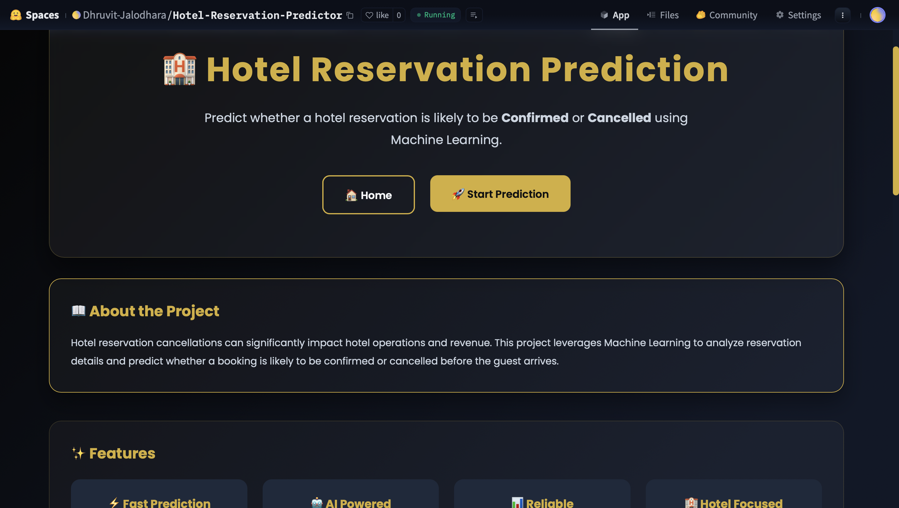
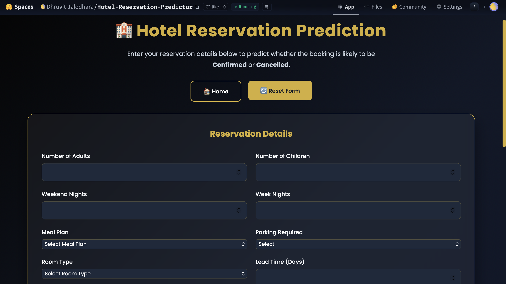
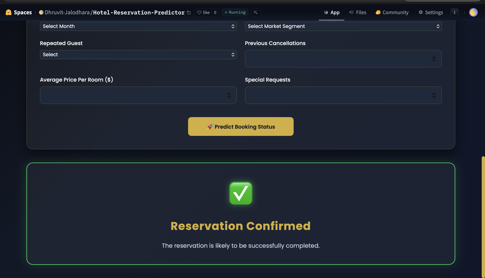
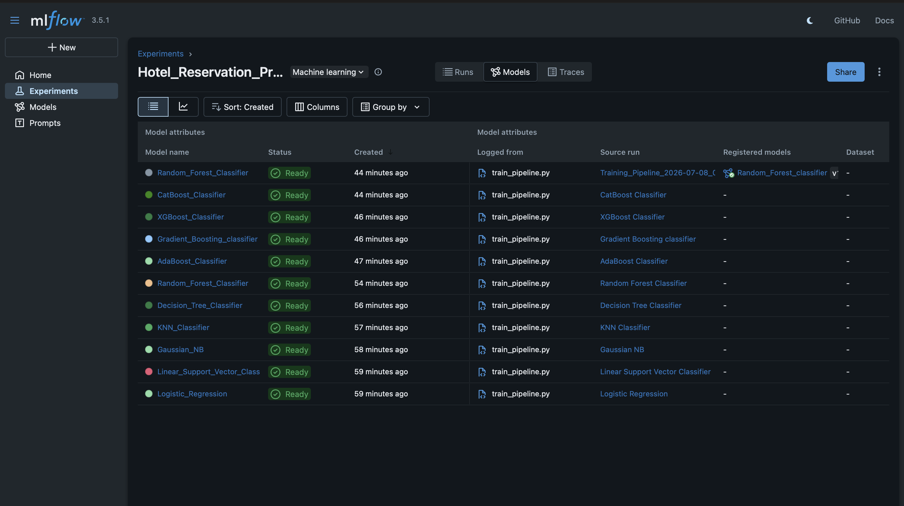

# 🏨 Hotel Reservation Prediction System

<div align="center">

### Predict Hotel Reservation Cancellation Using Machine Learning & MLOps

An end-to-end Machine Learning project that predicts whether a hotel reservation is likely to be **Cancelled** or **Not Cancelled**. The project demonstrates the complete ML lifecycle including data preprocessing, model training, experiment tracking, model deployment, and cloud hosting.

<br>


</div>

---

# 🌐 Project Links

- 🤗 **Live Demo:** [Hotel Reservation Predictor](https://huggingface.co/spaces/Dhruvit-Jalodhara/Hotel-Reservation-Predictor)

- 🐙 **GitHub Repository:** [Hotel-Reservation-Predictor](https://github.com/Dhruvit-Jalodhara/Hotel-Reservation-Predictor)

- 📊 **DagsHub Repository:** [DagsHub Project](https://dagshub.com/Dhruvit-Jalodhara/Hotel-Reservation-Predictor)

- 📈 **MLflow Tracking UI:** [MLflow Dashboard](https://dagshub.com/Dhruvit-Jalodhara/Hotel-Reservation-Predictor.mlflow/)

---

# 📖 Project Overview

Hotel reservation cancellations can significantly impact hotel operations by reducing revenue, affecting room allocation, and making resource planning more difficult.

This project develops an **End-to-End Machine Learning Pipeline** capable of predicting whether a reservation is likely to be **Cancelled** or **Not Cancelled** before the customer's arrival.

The project is built using modern Machine Learning and MLOps practices, including:

- Data Preprocessing Pipeline
- Multiple Classification Models
- Hyperparameter Tuning
- MLflow Experiment Tracking
- DagsHub Integration
- Flask Web Application
- Docker Containerization
- Hugging Face Deployment

---

# 🎯 Objectives

- Predict hotel reservation cancellation status.
- Build a complete production-ready ML pipeline.
- Compare multiple machine learning algorithms.
- Optimize models using RandomizedSearchCV.
- Track every experiment with MLflow.
- Store experiments remotely using DagsHub.
- Deploy the application using Docker and Hugging Face Spaces.

---

# ✨ Features

## 🤖 Machine Learning

- Multiple Classification Models
- Automatic Data Preprocessing
- Feature Scaling
- One-Hot Encoding
- Label Encoding
- Hyperparameter Tuning
- Best Model Selection
- Real-Time Prediction Pipeline

---

## 📊 MLOps

- MLflow Experiment Tracking
- Nested MLflow Runs
- Parameter Logging
- Metric Logging
- Artifact Logging
- Remote Experiment Storage with DagsHub

---

## 🌐 Web Application

- Flask Backend
- Interactive User Interface
- Responsive Design
- Dark Luxury Theme
- Instant Prediction

---

## ☁️ Deployment

- Docker Support
- Hugging Face Spaces
- DagsHub Integration
- GitHub Version Control

---

# 🏗️ Project Architecture

```text
                    Hotel Reservation Dataset
                               │
                               ▼
                      Data Ingestion
                               │
                               ▼
                   Data Transformation
                               │
      ┌────────────────────────┴────────────────────────┐
      ▼                                                 ▼
 Numerical Features                              Categorical Features
(StandardScaler)                          (OneHotEncoder + Scaling)
      │                                                 │
      └────────────────────────┬────────────────────────┘
                               ▼
                     Processed Training Data
                               │
                               ▼
                 Multiple Classification Models
                               │
                               ▼
          Hyperparameter Tuning (RandomizedSearchCV)
                               │
                               ▼
                    Best Model Selection
                               │
         ┌─────────────────────┴─────────────────────┐
         ▼                                           ▼
      MLflow                                   Saved Artifacts
   Experiment Tracking                    model.pkl
                                          preprocessor.pkl
                                          label_encoder.pkl
                               │
                               ▼
                     Prediction Pipeline
                               │
                               ▼
                    Flask Web Application
                               │
                               ▼
                      Docker Container
                               │
                               ▼
                   Hugging Face Spaces
```

---

# 🛠️ Tech Stack

| Category | Technologies |
|----------|--------------|
| Programming Language | Python 3.12 |
| Backend | Flask |
| Machine Learning | Scikit-Learn, XGBoost, CatBoost |
| Data Analysis | Pandas, NumPy |
| Experiment Tracking | MLflow |
| Hyperparameter Tuning | RandomizedSearchCV |
| MLOps | DagsHub |
| Deployment | Docker, Gunicorn, Hugging Face Spaces |
| Version Control | Git, GitHub |

---

# 📂 Project Structure

```text
Hotel-Reservation-Predictor/
│
├── artifacts/
│   ├── model.pkl
│   ├── preprocessor.pkl
│   └── label_encoder.pkl
│
├── notebook/
│
├── src/
│   ├── components/
│   │   ├── data_ingestion.py
│   │   ├── data_transformation.py
│   │   └── model_trainer.py
│   │
│   ├── pipeline/
│   │   ├── train_pipeline.py
│   │   └── predict_pipeline.py
│   │
│   ├── utils.py
│   ├── logger.py
│   ├── exception.py
│   └── hyperparameters.py
│
├── static/
│   ├── home.css
│   └── index.css
│
├── templates/
│   ├── index.html
│   └── home.html
│
├── app.py
├── Dockerfile
├── requirements.txt
├── setup.py
├── README.md
└── .gitignore
```

---

# 🚀 Workflow

```text
Dataset
   │
   ▼
Data Ingestion
   │
   ▼
Data Transformation
   │
   ▼
Model Training
   │
   ▼
Hyperparameter Tuning
   │
   ▼
Model Evaluation
   │
   ▼
MLflow + DagsHub
   │
   ▼
Save Best Model
   │
   ▼
Prediction Pipeline
   │
   ▼
Flask Web App
   │
   ▼
Docker
   │
   ▼
Hugging Face Spaces
```

---

# 📊 Dataset Overview

The dataset used in this project contains hotel reservation records along with their corresponding booking status. The objective is to build a classification model capable of predicting whether a reservation will be **Cancelled** or **Not Cancelled** before the customer's arrival.

The dataset contains both **numerical** and **categorical** features describing reservation details.

---

## 🎯 Target Variable

| Column | Description |
|---------|-------------|
| `booking_status` | Reservation Status (Canceled / Not_Canceled) |

During training, the target variable is encoded using **LabelEncoder** and converted into numerical values.

---

## 📋 Features Used

### Numerical Features

| Feature | Description |
|----------|-------------|
| no_of_adults | Number of adults |
| no_of_children | Number of children |
| no_of_weekend_nights | Weekend nights booked |
| no_of_week_nights | Weekday nights booked |
| required_car_parking_space | Parking requirement |
| lead_time | Days between booking and arrival |
| arrival_month | Arrival month (1–12) |
| repeated_guest | Whether the customer is a repeated guest |
| no_of_previous_cancellations | Previous cancellations |
| avg_price_per_room | Average room price |
| no_of_special_requests | Number of special requests |

---

### Categorical Features

| Feature | Description |
|----------|-------------|
| type_of_meal_plan | Selected meal plan |
| room_type_reserved | Reserved room type |
| market_segment_type | Booking source / market segment |

---

# 🧹 Data Preprocessing

Before training the Machine Learning models, the dataset undergoes preprocessing to ensure high-quality inputs.

The preprocessing pipeline is implemented using **Scikit-Learn's Pipeline** and **ColumnTransformer**, allowing the same transformations to be reused during prediction.

---

## Numerical Pipeline

The numerical features undergo the following transformations:

- Missing Value Imputation (Median)
- Feature Scaling using StandardScaler

```python
SimpleImputer(strategy="median")
StandardScaler()
```

---

## Categorical Pipeline

Categorical features are transformed using:

- Missing Value Imputation (Most Frequent)
- One-Hot Encoding
- Feature Scaling

```python
SimpleImputer(strategy="most_frequent")
OneHotEncoder(drop="first")
StandardScaler(with_mean=False)
```

---

## Target Encoding

The target column (`booking_status`) is converted into numerical values using **LabelEncoder**.

Example:

| Original | Encoded |
|----------|----------|
| Not_Canceled | 1 |
| Canceled | 0 |

The fitted LabelEncoder is saved as:

```text
artifacts/label_encoder.pkl
```

so that predictions can later be converted back into readable labels.

---

# ⚙️ Machine Learning Pipeline

The project follows an end-to-end modular Machine Learning pipeline.

```text
Dataset
    │
    ▼
Train-Test Split
    │
    ▼
Preprocessing Pipeline
    │
    ▼
Feature Scaling
    │
    ▼
Encoding
    │
    ▼
Model Training
    │
    ▼
Hyperparameter Tuning
    │
    ▼
Model Evaluation
    │
    ▼
Best Model Selection
    │
    ▼
Save Artifacts
```

---

# 🤖 Machine Learning Models

The following classification algorithms are trained and compared.

| Model |
|--------|
| Logistic Regression |
| Linear Support Vector Classifier |
| Gaussian Naive Bayes |
| K-Nearest Neighbors |
| Decision Tree |
| Random Forest |
| AdaBoost |
| Gradient Boosting |
| XGBoost |
| CatBoost |

Every model is evaluated using the same preprocessing pipeline.

---

# 🎯 Hyperparameter Tuning

To improve model performance, **RandomizedSearchCV** is used.

Instead of relying on default parameters, each model is tuned using a predefined hyperparameter search space.

Example:

```python
RandomizedSearchCV(
    estimator=model,
    param_distributions=params,
    scoring="f1",
    cv=5,
    n_iter=20,
    random_state=42
)
```

Benefits include:

- Better generalization
- Reduced overfitting
- Improved F1-score
- Automatic best parameter selection

All hyperparameter search spaces are stored separately in:

```text
src/hyperparameters.py
```

making the training code cleaner and easier to maintain.

---

# 📈 Model Evaluation

Each trained model is evaluated using the **F1 Score**, which balances Precision and Recall.

For every model, the following metrics are calculated:

- Training F1 Score
- Testing F1 Score
- Train-Test Gap

Models with excessive overfitting are filtered by comparing the difference between training and testing performance.

The best-performing model is selected based on:

- Highest Test F1 Score
- Minimal Train-Test Gap

---

# 📊 MLflow Experiment Tracking

The project integrates **MLflow** to track every experiment during model training.

For each model, MLflow automatically logs:

### Parameters

- Hyperparameters
- Best Parameters from RandomizedSearchCV

### Metrics

- Training F1 Score
- Testing F1 Score
- Cross Validation Score
- Train-Test Gap

### Artifacts

- Trained Model
- Preprocessor
- Label Encoder

The project also uses **Nested MLflow Runs**, allowing each algorithm to appear as a child run under a single training pipeline.

This makes experiment comparison significantly easier.

---

# ☁️ DagsHub Integration

MLflow is connected to **DagsHub**, enabling cloud-based experiment tracking.

Benefits include:

- Remote MLflow Tracking Server
- Cloud Storage for Experiments
- Centralized Experiment History
- Team Collaboration
- Easy Model Comparison

Every experiment performed locally is synchronized with DagsHub, allowing access from any device through the web interface.

---

# 🏆 Model Selection Strategy

Instead of selecting the first high-performing model, the project follows a structured evaluation strategy.

The workflow is:

```text
Train Model
      │
      ▼
Hyperparameter Tuning
      │
      ▼
Evaluate F1 Score
      │
      ▼
Compare Train/Test Gap
      │
      ▼
Filter Overfitted Models
      │
      ▼
Select Best Model
      │
      ▼
Save Model
```

The selected model, preprocessing pipeline, and label encoder are stored inside the `artifacts/` directory and later loaded by the Flask prediction pipeline.

---

# 🚀 Getting Started

## Prerequisites

Before running the project locally, make sure the following software is installed on your system.

- Python 3.12 or above
- Git
- Docker Desktop (Optional)
- Conda / Virtual Environment
- VS Code (Recommended)

---

# 📥 Clone the Repository

```bash
git clone https://github.com/Dhruvit-Jalodhara/Hotel-Reservation-Predictor.git

cd Hotel-Reservation-Predictor
```

---

# 📦 Create Virtual Environment

Using Conda

```bash
conda create -p venv python=3.12 -y

conda activate ./venv
```

or using Python

```bash
python -m venv venv

source venv/bin/activate        # macOS/Linux

venv\Scripts\activate           # Windows
```

---

# 📥 Install Dependencies

```bash
pip install -r requirements.txt
```

---

# ⚙️ Train the Model

Run the complete training pipeline.

```bash
python src/pipeline/train_pipeline.py
```

During training, the following artifacts will be created automatically.

```text
artifacts/
│
├── model.pkl
├── preprocessor.pkl
└── label_encoder.pkl
```

---

# 📊 MLflow Experiment Tracking

Before training, start the MLflow tracking server.

```bash
mlflow server \
--host 127.0.0.1 \
--port 8000
```

Open the MLflow UI:

```text
http://127.0.0.1:8000
```

If using DagsHub as the remote tracking server, configure the tracking URI before training.

```python
mlflow.set_tracking_uri(...)
mlflow.set_experiment(...)
```

Every training run automatically logs:

- Parameters
- Hyperparameters
- Training Metrics
- Testing Metrics
- Cross Validation Score
- Artifacts

---

# 🌐 Run the Flask Application

```bash
python app.py
```

The application will be available at

```text
http://127.0.0.1:5000
```

---

# 🐳 Docker Support

## Build Docker Image

```bash
docker build -t hotel-reservation-predictor .
```

---

## Run Docker Container

```bash
docker run -p 5000:5000 hotel-reservation-predictor
```

The application will be available at

```text
http://localhost:5000
```

---

# 🤗 Hugging Face Deployment

This project is deployed on **Hugging Face Spaces** using **Docker**.

### Live Application

https://huggingface.co/spaces/Dhruvit-Jalodhara/Hotel-Reservation-Predictor

Deployment includes:

- Docker Container
- Flask Backend
- Trained Model
- Preprocessor
- Label Encoder

---

# 📊 MLflow Dashboard

The project uses **MLflow** for experiment tracking.

Tracked information includes:

- Model Parameters
- Hyperparameters
- Training Metrics
- Testing Metrics
- Best Cross Validation Score
- Best Model
- Artifacts

### MLflow Tracking UI

https://dagshub.com/Dhruvit-Jalodhara/Hotel-Reservation-Predictor.mlflow/

---

# ☁️ DagsHub Integration

The project integrates **DagsHub** as the remote MLOps platform.

Repository:

https://dagshub.com/Dhruvit-Jalodhara/Hotel-Reservation-Predictor

DagsHub stores:

- MLflow Experiments
- Training Metrics
- Hyperparameters
- Git Repository
- Model Artifacts

---

# 📸 Application Screenshots

You can include screenshots here after deployment.

## 🏠 Landing Page




---

## 📋 Prediction Page



---

## ✅ Prediction Result




---

## 📊 MLflow Dashboard




---


# 🔮 Future Improvements

Some possible future enhancements include:

- User Authentication
- Booking Cancellation Probability (%)
- Explainable AI using SHAP
- Model Registry with MLflow
- CI/CD using GitHub Actions
- Kubernetes Deployment
- AWS / Azure Deployment
- Automated Data Validation
- Continuous Model Retraining
- REST API using FastAPI
- Database Integration

---

# 📚 References

- Scikit-Learn Documentation
- Flask Documentation
- MLflow Documentation
- DagsHub Documentation
- Hugging Face Spaces Documentation
- Docker Documentation
- CatBoost Documentation
- XGBoost Documentation

---

# 👨‍💻 Author

**Dhruvit Jalodhara**

Integrated B.Tech + M.Tech (Artificial Intelligence)

Sardar Vallabhbhai National Institute of Technology (SVNIT), Surat

### GitHub

https://github.com/Dhruvit-Jalodhara

### LinkedIn

(Add your LinkedIn Profile)

---

# 🤝 Contributing

Contributions, issues, and feature requests are welcome.

If you would like to improve the project:

1. Fork the repository.
2. Create a new feature branch.
3. Commit your changes.
4. Push to your branch.
5. Open a Pull Request.

---

# ⭐ Show Your Support

If you found this project useful, consider giving it a ⭐ on GitHub.

It helps others discover the project and motivates future improvements.

---

# 📄 License

This project is licensed under the **MIT License**.

You are free to use, modify, and distribute this project under the terms of the license.

---

<div align="center">

## ⭐ Thank You for Visiting!

If you like this project, don't forget to **Star ⭐ the repository** and explore the live application on **Hugging Face Spaces**.

**Happy Learning! 🚀**

</div> 